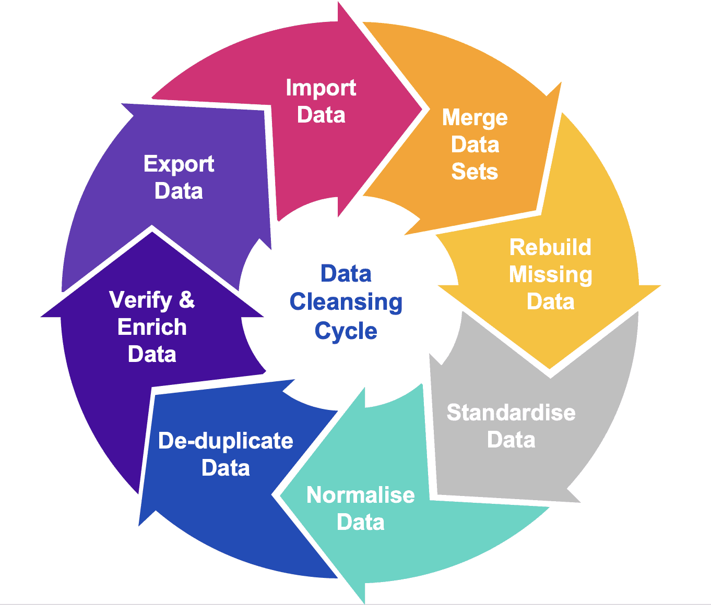

# DataCleaning
Fundamentals of Data Cleaning

Data cleaning is an essential process in data analysis, involving handling errors, missing data, duplicates, and outliers to prepare the data for analysis. Here's a basic introduction to common data cleaning techniques using Python:

# Libraries:
You'll need some basic libraries to work with data in Python:

### Pandas: Provides high-level data manipulation tools.
### NumPy: Used for numerical computations.

```bash
pip install pandas numpy
```

# Basic Steps in Data Cleaning
## 1. Loading the Data
The first step is to load your data into a DataFrame using Pandas.

```python
import pandas as pd
# Load the data from a CSV file
df = pd.read_csv('data.csv')
```

## 2. Handling Missing Data
Missing data is common in real-world datasets. You can either remove or fill missing values.

- Checking for missing values:
```python
# Check for missing values
print(df.isnull().sum())
```
- Removing rows with missing data:
```python
# Drop rows with any missing values
df_cleaned = df.dropna()
```

- Filling missing values:
```python

# Fill missing values with a specific value (e.g., 0 or mean)
df['column_name'] = df['column_name'].fillna(0)

# Fill missing values with the mean of the column
df['column_name'] = df['column_name'].fillna(df['column_name'].mean())
```

# 3. Removing Duplicates
Duplicate data can skew analysis, so it's important to identify and remove it.

```python
# Find duplicates
duplicates = df[df.duplicated()]

# Remove duplicates
df_cleaned = df.drop_duplicates()
```

# 4. Converting Data Types
Sometimes, data may be in the wrong format (e.g., strings instead of integers).

```python
# Convert a column to a numeric data type
df['column_name'] = pd.to_numeric(df['column_name'], errors='coerce')

# Convert to datetime
df['date_column'] = pd.to_datetime(df['date_column'], errors='coerce')
```

# 5. Handling Outliers
Outliers can distort statistical analysis, so you may want to remove or treat them.

Removing outliers using interquartile range (IQR):
```python
Q1 = df['column_name'].quantile(0.25)
Q3 = df['column_name'].quantile(0.75)
IQR = Q3 - Q1

# Define bounds for outliers
lower_bound = Q1 - 1.5 * IQR
upper_bound = Q3 + 1.5 * IQR

# Filter out outliers
df_cleaned = df[(df['column_name'] >= lower_bound) & (df['column_name'] <= upper_bound)]
```

# 6. Renaming Columns
For consistency and readability, it’s a good practice to rename columns.

```python
# Rename a specific column
df.rename(columns={'old_name': 'new_name'}, inplace=True)
```

# 7. Standardizing Data
Standardizing data (such as lowercasing all text in a column) can improve consistency.

```python
# Convert all text to lowercase
df['column_name'] = df['column_name'].str.lower()

# Strip leading and trailing whitespace
df['column_name'] = df['column_name'].str.strip()
```
# 8. Dealing with Invalid Data
You may encounter invalid data that doesn't fit expected values. You can remove or correct it.

```python
# Remove rows where column_name has invalid data
df_cleaned = df[df['column_name'].apply(lambda x: isinstance(x, (int, float)))]
```

# Example Workflow

```python

import pandas as pd
import numpy as np

# Load the data
df = pd.read_csv('data.csv')

# Handle missing data
df.fillna(df.mean(), inplace=True)

# Remove duplicates
df.drop_duplicates(inplace=True)

# Convert column to numeric
df['age'] = pd.to_numeric(df['age'], errors='coerce')

# Handle outliers
Q1 = df['salary'].quantile(0.25)
Q3 = df['salary'].quantile(0.75)
IQR = Q3 - Q1
lower_bound = Q1 - 1.5 * IQR
upper_bound = Q3 + 1.5 * IQR
df = df[(df['salary'] >= lower_bound) & (df['salary'] <= upper_bound)]

# Rename columns
df.rename(columns={'Name': 'name'}, inplace=True)

# Convert text to lowercase
df['name'] = df['name'].str.lower()

# Final cleaned data
print(df.head())
```

# Additional Cleaning Functions

```
# Check for missing values
print(df.isnull().sum())

# Drop rows with any missing values
df_cleaned = df.dropna()

# Fill missing values with a specific value (e.g., 0 or mean)
df['column_name'] = df['column_name'].fillna(0)

# Fill missing values with the mean of the column
df['column_name'] = df['column_name'].fillna(df['column_name'].mean())

# Find duplicates
duplicates = df[df.duplicated()]

# Remove duplicates
df_cleaned = df.drop_duplicates()

# Convert a column to a numeric data type
df['column_name'] = pd.to_numeric(df['column_name'], errors='coerce')

# Convert a column to a numeric data type
df['column_name'] = pd.to_numeric(df['column_name'], errors='coerce')

# Convert a column to a numeric data type
df['column_name'] = pd.to_numeric(df['column_name'], errors='coerce')

# Convert a column to a numeric data type
df['column_name'] = pd.to_numeric(df['column_name'], errors='coerce')

# Convert a column to a numeric data type
df['column_name'] = pd.to_numeric(df['column_name'], errors='coerce')

# Melt the DataFrame
df_melted = pd.melt(df, id_vars=['id_vars'], value_vars=['value_vars'])

# Merge two DataFrames
df_merged = pd.merge(df1, df2, on='common_column')

# Concatenate DataFrames
df_concat = pd.concat([df1, df2], axis=0)

# Sort by column values
df_sorted = df.sort_values(by='column_name', ascending=False)

# Reset index
df_reset = df.reset_index(drop=True)

# Set a column as index
df_indexed = df.set_index('column_name')

# Remove outliers
df_no_outliers = df[(df['column_name'] > lower_bound) & (df['column_name'] < upper_bound)]

# Cap outliers
df['column_name'] = df['column_name'].clip(lower=lower_bound, upper=upper_bound)

# Create a new column based on a condition
df['new_column'] = df['column_name'].apply(lambda x: 'High' if x > threshold else 'Low')

# Apply a function to a column
df['column_name'] = df['column_name'].apply(lambda x: x * 2)

# Convert to uppercase
df['column_name'] = df['column_name'].str.upper()

# Convert to datetime
df['date_column'] = pd.to_datetime(df['date_column'])

# Extract year from date
df['year'] = df['date_column'].dt.year

# Calculate rolling mean
df['rolling_mean'] = df['column_name'].rolling(window=3).mean()

# Calculate cumulative sum
df['cumsum'] = df['column_name'].cumsum()

# Interpolate missing values
df['column_name'] = df['column_name'].interpolate()

# One-hot encode categorical variables
df_encoded = pd.get_dummies(df, columns=['categorical_column'])

# Normalize data
df['normalized_column'] = (df['column_name'] - df['column_name'].min()) / (df['column_name'].max() - df['column_name'].min())

# Bin data into intervals
df['binned_column'] = pd.cut(df['column_name'], bins=[0, 10, 20, 30], labels=['Low', 'Medium', 'High'])
```
